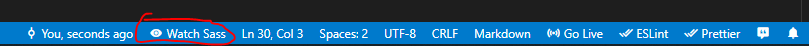

# InstaArt
Aplikasi eweb portofolio untuk designer. 

## Bahasa lain
- [English](./README.md)

<!-- ## Website
https://instaart.cybertwenty.com -->

## Build File SCSS
### Dengan extension vs code extension Live Sass Compiler (Yang saya rekomendasikan)
- Pastikan vs code anda sudah terinstall [Live Sass Compiler](https://marketplace.visualstudio.com/items?itemName=ritwickdey.live-sass).
- Klik "Watch Sass" di status bar.
  

### Dengan Node Js :
- Pastikan komputer anda sudah terinstall npm.
- Install module yang diperlukan : 
```bash 
  npm i
```
- Terus menerus membuild Sass file :
```bash 
  npm run dev
```
- jika anda ingin membuild Sass untuk tujuan production :
```bash 
  npm run build
```

---
## LICENSE
[MIT](./LICENSE.md)

<!-- © Dibuat Oleh [Yusril A. P.](https://github.com/yusril-adr) -->